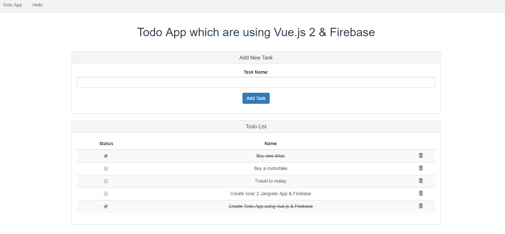

# todoapp

> A todoapp using Vue.js and firebase



## Build Setup

``` bash
# install dependenciesf
npm install

# serve with hot reload at localhost:8080
npm run dev

# build for production with minification
npm run build

# build for production and view the bundle analyzer report
npm run build --report
```

For detailed explanation on how things work, checkout the [guide](http://vuejs-templates.github.io/webpack/) and [docs for vue-loader](http://vuejs.github.io/vue-loader).

Userful resources 
=====================
1. https://www.youtube.com/watch?v=z6hQqgvGI4Y

2. https://medium.com/codingthesmartway-com-blog/vue-js-2-firebase-e4b2479e35a8#.bhujebdun

3. https://vuejs.org/v2/guide/installation.html